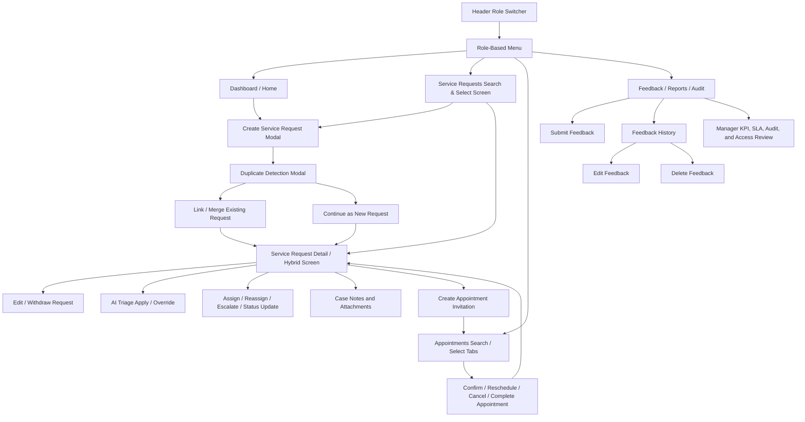

# CivicConnect - Service Request & Case Management System

High-fidelity React + TypeScript prototype for ABC City Council service request and case management workflows. The app uses mock data and browser-local React state only; there is no backend or real authentication.

## Run

```bash
npm install
npm run dev
```

Open the Vite URL shown in the terminal.

## Prototype Coverage

- Role switcher in the header for Citizen, Officer, Specialist Team Member, and Manager.
- Role-aware navigation, dashboards, request visibility, and actions.
- Service request CRUD-style flow with validation, multiple attachments, duplicate detection, linking, filtering, status chips, AI triage, assignment, escalation, and timeline history.
- Request detail view with summary, citizen info, linked cases, attachments, notes, AI suggestion apply/override, role actions, and audit-style history.
- Appointments with recommended slots, alternatives, citizen confirm/reschedule/cancel flows, officer notes, and specialist completion actions.
- Feedback/reporting area that changes by role:
  - Citizen: submit feedback for resolved cases and view feedback history.
  - Officer/Specialist: operational reporting widgets.
  - Manager: KPI cards, SLA warnings, escalation tables, simple charts, audit log, role/access overview, and AI override monitoring.

## CRUD Requirement Fit

The prototype models CRUD-style screens for the main entity, `Service Request`, and two associated entities, `Appointment` and `Feedback`.

| Entity | Create | Read / Search / Select | Update | Delete / Close Equivalent |
| --- | --- | --- | --- | --- |
| Service Request | Citizen or Officer creates/logs a request from `/requests` or the dashboard quick action. | `/requests` provides search, filters, and selectable request rows/cards. `/requests/:id` provides the detail/hybrid screen. | Citizen edits eligible open requests. Officer/Manager update status, assignment, priority, escalation, AI triage, links, notes, and appointments. Specialist accepts, notes, uploads evidence, and resolves. | Citizen can withdraw eligible requests. Staff can close or resolve requests using status controls. |
| Appointment | Officer creates an appointment invitation from the service request detail screen. | `/appointments` provides upcoming/past tabs and selectable appointment cards linked to requests. | Citizen confirms/reschedules/adds notes. Officer updates notes/confirms booking. Specialist completes site visits. | Citizen cancels appointments; cancelled records remain visible as history. |
| Feedback | Citizen submits feedback for feedback-pending cases from `/reports`. | Citizen feedback history is shown in `/reports`; Manager sees feedback quality reports. | Citizen can edit rating and comments from feedback history. | Citizen can delete feedback; the case returns to feedback pending. |

## CRUD Screen Navigation Diagram



## Menu Option and User-Role Access

| Menu option | Citizen | Officer | Specialist Team Member | Manager |
| --- | --- | --- | --- | --- |
| Dashboard | Own request summary, appointments, feedback pending | Operational queue and booking summary | Assigned work queue and visits | KPI, SLA, escalation dashboard |
| Service Requests | Create, search, view own, edit/withdraw eligible own requests | Create/log, search all, triage, assign, status, escalate, send booking link | View assigned requests, accept, add notes/files, resolve | View all, override priority/status, clear escalations |
| Request Detail | Status timeline, attachments, linked requests, appointment link, feedback path | AI review, duplicate links, assignment, notes, status, booking | Investigation notes, uploads, appointment completion, resolution | Escalation handling, priority/status override, and highest-authority decisions |
| Appointments | View own invitations, confirm, reschedule, cancel, add notes | Manage all appointments, update officer notes, confirm bookings | View assigned visits, complete site visits | Monitor all appointments |
| Feedback / Reports / Audit | Submit, view, edit, and delete own feedback | Team operational reporting | Team operational reporting | KPI reports, SLA warnings, escalations, feedback quality, audit log, role/access overview, and AI override records |

## Demo Tips

1. Start as `Citizen` and create a new request from the dashboard or service request page.
2. Use a similar roads/King Street issue to trigger the duplicate detection modal.
3. Switch to `Officer` to assign, update status, escalate, or send an appointment booking link.
4. Switch to `Specialist Team Member` to accept a case, add notes/files, complete a visit, and mark a case resolved.
5. Switch back to `Citizen` to manage the appointment and submit feedback for feedback-pending cases.
6. Use `Manager` to review KPI, escalation, audit, role/access, and AI override views. Manager is the highest authority role in the system.
